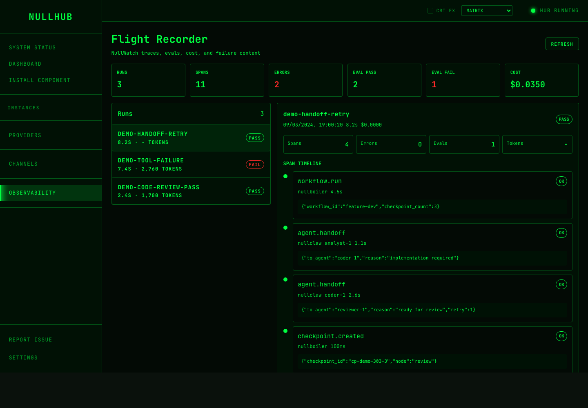
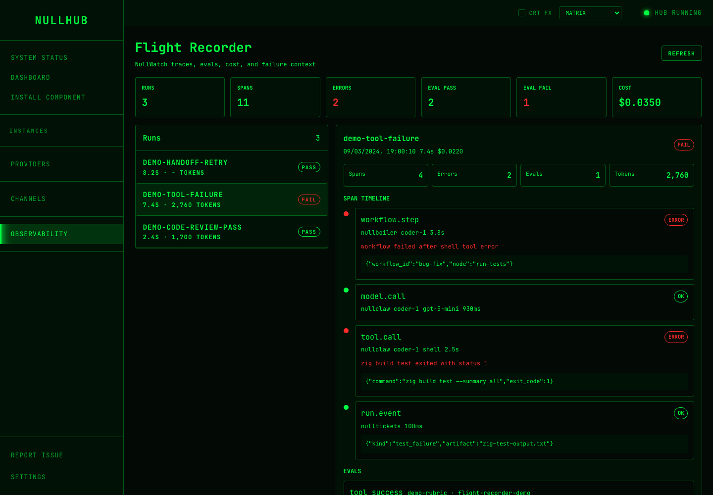

# Agent Flight Recorder

## Problem Discovered

NullWatch already provides the observability layer for the nullclaw ecosystem:
run summaries, spans, evals, OTLP ingest, cost, token usage, and failure context.
It also exports a NullHub-compatible manifest. NullHub already provides the
operator UI and orchestration pages, but it did not register NullWatch or expose
its tracing/eval data in the UI.

## Chosen Solution

Add a local-first Observability cockpit to NullHub:

- register `nullwatch` as a known component
- proxy `/api/observability/*` to a local NullWatch instance
- add a Flight Recorder page for runs, spans, evals, cost, tokens, and errors
- document the local demo flow with `NULLWATCH_URL`

## Why This Idea Was Chosen

This is stronger than a single CLI preflight because it connects multiple parts
of the ecosystem into a visible agent platform story: execution, orchestration,
task tracking, observability, and operations. It is still hackathon-sized because
it uses existing NullWatch APIs and NullHub UI patterns instead of changing core
agent runtime behavior.

## What Was Implemented

- NullWatch component registration in the NullHub registry.
- Observability reverse proxy with optional bearer token forwarding.
- Sidebar entry and `/observability` UI page.
- API client methods for NullWatch summary, runs, spans, evals, and health.
- README documentation for the proxy and local demo setup.

## Files Changed

- `src/installer/registry.zig`
- `src/api/observability.zig`
- `src/api/proxy.zig`
- `src/api/components.zig`
- `src/api/meta.zig`
- `src/root.zig`
- `src/server.zig`
- `ui/src/lib/api/client.ts`
- `ui/src/lib/components/Sidebar.svelte`
- `ui/src/routes/observability/+page.svelte`
- `README.md`
- `HACKATHON_SUBMISSION.md`

## How To Test Or Demo

Start NullHub with the observability proxy configured:

```bash
NULLWATCH_URL=http://127.0.0.1:7710 zig build run -- serve --no-open
```

Install NullWatch from NullHub:

1. Open the web UI.
2. Go to `Install Component`.
3. Select `NullWatch`.
4. Keep the API port at `7710` or update `NULLWATCH_URL` to match the chosen
   port.
5. Finish the wizard. The installer starts the NullWatch instance.

Optional sample data can be ingested through the NullHub proxy:

```bash
curl -X POST http://127.0.0.1:19800/api/observability/v1/spans \
  -H 'Content-Type: application/json' \
  -d '{"run_id":"demo-run-1","trace_id":"trace-demo-1","span_id":"span-1","source":"nullclaw","operation":"tool.call","status":"error","started_at_ms":1710000000000,"ended_at_ms":1710000001500,"tool_name":"shell","error_message":"tool call failed: command timed out","attributes_json":"{\"exit_code\":124}"}'

curl -X POST http://127.0.0.1:19800/api/observability/v1/evals \
  -H 'Content-Type: application/json' \
  -d '{"run_id":"demo-run-1","eval_key":"tool_success","scorer":"deterministic","score":0.0,"verdict":"fail","dataset":"demo","notes":"The tool call timed out."}'
```

Open `/observability` in NullHub and inspect the NullWatch runs.

## Screenshots

Flight Recorder overview:



Failure detail with tool-call error context:



## Limitations And Future Improvements

- The MVP reads from a configured `NULLWATCH_URL`; automatic discovery of managed
  NullWatch instances can be added later.
- The first UI version renders a compact timeline, not a full waterfall chart.
- Run correlation with NullBoiler orchestration pages can be added as a follow-up
  when both systems share stable run ids.
